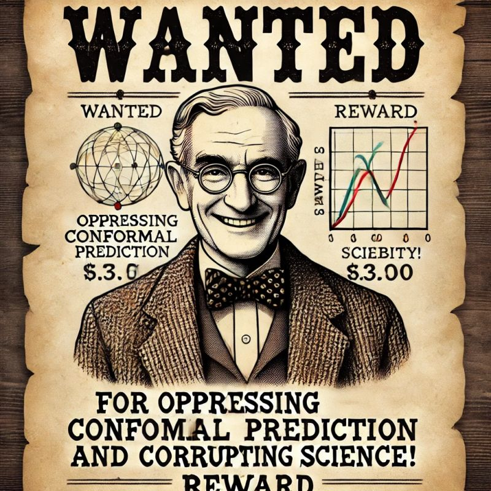

# bayesianism_is_what_you_dont_need
The best repository showing why bayesianism is a complete misnomer.

If you see credible evidence that certain papers and academics deliberately excluded conformal prediction please feel free to contact me in confidence.

Every quality paper and entry that qualifies for entry to bayesianism_is_what_you_dont_need will be awarded a discount for my course and after a certain number of submissions that are accepted your place is free!

## [Table of Contents]() 

* [PhD and MSc Theses](#theses)

* [Videos](#videos) 
 
* [Papers](#papers)

* [Articles](#articles)
* [Academic censoring and oppressing conformal prediction](#censors_and_opressors) 

## Papers
1. [The typicalness framework: a comparison with the Bayesian approach](https://core.ac.uk/download/pdf/1503425.pdf) (2001)
2. [On the Brittleness of Bayesian Inference](https://arxiv.org/abs/1308.6306) (2015) 

## Videos
1. [Larry Wasserman - Problems With Bayesian Causal Inference](https://www.youtube.com/watch?v=sZyyaNdvfto) (2022)

## Articles
1. [Praxis and Ideology in Bayesian Data Analysis](http://bactra.org/weblog/664.html) by Cosma Shalizi (2010)
2. [Bayes is Out-Dated, and You’re Doing it Wrong](https://www.lesswrong.com/posts/oqxYzDrwMAdQhCwHL/bayes-is-out-dated-and-you-re-doing-it-wrong)

## Academic censoring and oppressing conformal prediction
1. XXX
